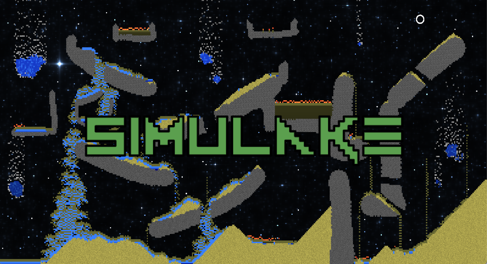

# Simulake

A cellular automata physics simulator.



## Cloning

External dependencies are included as git submodules in `lib`. Clone source
files and dependencies using:

```
git clone git@github.com:patilatharva/simulake.git --recursive
```

## Building with CMake

```
mkdir build && cd build
cmake -DCMAKE_BUILD_TYPE=Release ..
make
```

For debug build, use the `-DCMAKE_BUILD_TYPE=Debug` flag.

## Usage

```
./simulake [OPTION...]

-x, --width arg     grid width in cells (default: 400)
-y, --height arg    grid height in cells (default: 200)
-c, --cellsize arg  cell size in pixels (default: 4)
-g, --gpu           enable GPU acceleration
-l, --load arg      load scene from disk
-h, --help          print help
```

| Command                    | Key            |
| -------------------------- | -------------- |
| Exit the program           | `ESC`          |
| Select AIR cell type       | `0`            |
| Select SMOKE cell type     | `1`            |
| Select FIRE cell type      | `2`            |
| Select WATER cell type     | `3`            |
| Select OIL cell type       | `4`            |
| Select SAND cell type      | `5`            |
| Select JET_FUEL cell type  | `6`            |
| Select STONE cell type     | `7`            |
| Print app state to console | `P`            |
| Save grid to disk          | `S`            |
| Enter edit mode (pause)    | `SPACEBAR`     |
| Change "brush" size        | (Scroll wheel) |

## Dependencies

- [glfw](https://github.com/glfw/glfw)
- [glad](https://github.com/Dav1dde/glad)
- [glm](https://github.com/g-truc/glm)
- [cxxopts](https://github.com/jarro2783/cxxopts)
- [threadpool](https://github.com/bshoshany/thread-pool)
- [cmake](http://www.cmake.org/)

## Resources

- [Noita: a Game Based on Falling Sand Simulation](https://80.lv/articles/noita-a-game-based-on-falling-sand-simulation/)
- [Simple Fluid Simulation With Cellular Automata](https://w-shadow.com/blog/2009/09/01/simple-fluid-simulation/)
- [Cellular Automata for Physical Modelling](https://tomforsyth1000.github.io/papers/cellular_automata_for_physical_modelling.html)
